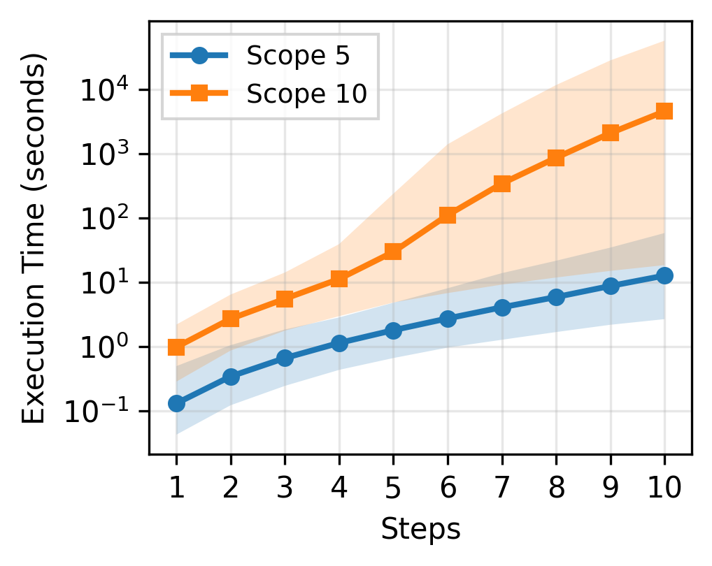

# Alloy model for ZK rollups

The model is developed in Alloy 6.1. The properties and testing scenarios are checked with glucose 4.1 SAT solver.

Code accompanying "Towards a formal foundation of blockchain rollups" paper.
 
## Contents

* `rollup_data_model.als` definition of datatypes associated with basic entities of ZK rollups.
   - `Input` abstract inputs (transactions);
   - `Block` encapsulate sequence of inputs;
   - `Proof` and `Commitment` represent proofs and commitments submitted from L2 to L1 for block finalization;
   - `ForcedEvent` events forced upon L2 through L1;
   - `UpgradeAnnouncement` abstract datatype which represents an announcement of an upgrade;
   - `Timeout`  after upgrade announcement users get a period of time to act on the "upgrade announcement". The end of this period is signalled by the timeout event.
   - `L1` a singleton object with fields which represent the state of L2 rollup on L1;
* `rollup_dynamics.als` implementation of queries associated with ZK-rollups.
   - `receive_commitment` receives a commitment for later process.
   - `receive_proof` receives a proof for later process.
   - `receive_forced` receives a forced event, appends it to the queue unless upgrade is in the processing mode.
   - `rollup_process` tries to finalize previously received commitment and the proof.
   - `update_blacklist` processes the blacklisting event from the head of the forced queue.
   - `upgrade_init` receives the `UpgradeAnnouncement` and sets the `L1.ongoing_upgrade` field.
   - `upgrade_timeout` receives a timeout indicating that the current queueing phase of the upgrade has finished.
   - `upgrade_deploy` deploys the upgrade once the processing phase has ended (i.e., forced queue is empty).
   - `stutter`  ensures that traces are infinite
   - `events` set of possible events.
* `rollup_properties.als` specification of properties.
   - `srp*` - properties associated with the basic ("strawnan") rollups;
   - `fqp*` - properties associated with forced queues;
   - `bp*` - properties associated with rollups with "eager" blacklists updated through the forced queue;
   - `up*` - properties associated with "soft" blacklists updated through the upgradeability mechanism;
* `rollup_scenarios.als` various scenarios for testing.

For a thorough documentation of the codebase and the mapping you can check `DOCUMENTATION.md`

## Running Alloy Checks through VSCode plug-in

If you install the plug-in `ArashSahebolamri.alloy` then you can run the `check` properties from `rollup_properties.als` and the `run` scenarios from `rollup_scenarios.als` through the VSCode idea by going to the definitions and click on `execute`.

## Running Alloy Checks from the Command Line (Java)

This project includes a Java utility (`AlloyRunner.java`) for running Alloy checks and saving results to CSV/XML files.

### **Requirements**
- Java 8 or later
- Alloy 6.1 libraries (must be on your classpath)
  - You can download Alloy from https://alloytools.org/download.html
  - The required JARs are typically in the `lib/` directory of the Alloy distribution (e.g., `alloy4.jar`, `alloy4compiler.jar`, `alloy4viz.jar`, `kodkod.jar`)

### Instructions to install everything in a clean Ubuntu 24.04 LTS

```
sudo apt install default-jre default-jdk
mkdir lib
curl -L -o lib/org.alloytools.alloy.dist.jar \
  https://github.com/AlloyTools/org.alloytools.alloy/releases/download/v6.2.0/org.alloytools.alloy.dist.jar
```

### **Compiling**

1. Place `AlloyRunner.java` in your project directory.
2. Download the Alloy 6.1 JARs and place them in a `lib/` directory (or anywhere you prefer).
3. Compile with:
   
   ```sh
   javac -cp "lib/*" AlloyRunner.java
   ```
   (On Windows, use `lib/*;` as the separator if needed.)

### **Running**

Run the program with:

```sh
java -cp ".:lib/*" AlloyRunner <als_file> <output_dir> [command_index]
```
- `<als_file>`: Path to your Alloy model file (e.g., `rollup_properties.als`)
- `<output_dir>`: Directory where results will be saved (must not already exist)
- `[command_index]`: (Optional) Index of the command to run (0-based). If omitted, all commands are run.

**Examples:**

- Run all commands and save results:
  ```sh
  java -cp ".:lib/*" AlloyRunner rollup_properties.als results_dir
  ```
- Run only the first command (index 0):
  ```sh
  java -cp ".:lib/*" AlloyRunner rollup_properties.als results_dir 0
  ```

**Note:**
- On Windows, replace `:` with `;` in the classpath.
- The program will create `<output_dir>` and save all CSV and XML result files there.
- If `<output_dir>` already exists, the program will exit with a message.

## Generating Custom Alloy Files with Different Scopes

This repository provides a template system for generating Alloy property files with custom scopes and step counts.
The default scope used is 5 for 5 steps which is sufficiently small to run in a timely manner in any machine. 
Yet, it is useful to run using a larger scope and steps to model check more thorough configurations and exploring deeper states for the model.

### **How it works**
- The file `rollup_properties_template_N_M.als` contains placeholders `{{N}}` and `{{M}}` in all check commands (e.g., `for {{N}} but 1..{{M}} steps`).
- The script `prepare_template.sh` takes two arguments (N and M), replaces the placeholders, and produces a file named `rollup_properties_N_M.als`.

### **Usage**

```sh
./prepare_template.sh N M
```
- Replace `N` and `M` with the desired scope and max steps (e.g., `./prepare_template.sh 10 7`)
- The script will generate a file called `rollup_properties_N_M.als` (e.g., `rollup_properties_10_7.als`)

### **Example**

To generate a file for scope 20 and 8 steps:

```sh
./prepare_template.sh 20 8
```

This will create `rollup_properties_20_8.als` with all check commands using `for 20 but 1..8 steps`.

**Note:**
- You must have `rollup_properties_template_N_M.als` in the same directory as the script.
- The script will print the output filename if successful.

## Benchmarks

```bash
./prepare_template.sh 5 10
java -cp ".:lib/*" AlloyRunner rollup_properties_5_10.als results_5_10
./prepare_template.sh 10 10
java -cp ".:lib/*" AlloyRunner rollup_properties_10_10.als results_10_10
# Any other config
./prepare_template.sh 15 15
java -cp ".:lib/*" AlloyRunner rollup_properties_15_15.als results_15_15
```

### Results

You should move your results to `results` directory. This directory is pre-populated with results for 5_10 and 10_10 from a Mac M1 Max with 64 GB RAM.

To get a thorough analysis of the results run the following script (after installing the dependencies):

```bash
python analyze_results.py
```

This will create a thorough report in the CLI and it will produce various reports in the directory `reports`.

Here are some of the main results we got on the aforementioned machine.

#### MECHANISM SUMMARY TABLE (MEDIAN VALUES) - Scope 5, Steps 1-10

| Mechanism | Lines of Code | No. of Clauses | Solve time (sec) |
|-----------|---------------|-----------------|------------------|
| Simple | 295 | 181,856 | 4.901 |
| Forced Queue | 529 | 202,117 | 2.032 |
| Blacklist | 721 | 183,273 | 2.715 |
| Upgradeability | 970 | 247,198 | 1.649 |



**Figure: Alloy Verification Performance**

This figure displays the execution time (in seconds, log scale) required to verify security properties for different zk-rollup mechanisms as a function of the number of steps, for two different scope sizes (5 and 10). The x-axis shows the number of steps (from 1 to 10), while the y-axis shows the execution time on a logarithmic scale, ranging from 0.1 to 10,000 seconds. 

Two lines are plotted:
- **Scope 5** (blue circles)
- **Scope 10** (orange squares)

Shaded regions around each line indicate the min-max range of execution times for each step, capturing the variance across different properties.

## Alloy Metamodel for the Forced Queue and Upgradeability Model

The figure below illustrates the metamodel used for formalizing the forced queue and upgradeability model in Alloy. The metamodel depicts various components and their connections within the system.


